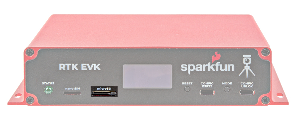

In this section, we'll go over how to connect to the SparkFun RTK EVK.

### Cellular Antenna

To take advantage of the LTE cellular network with the LARA-R6, you will need to connect to the two LTE antennas on the back panel. Insert the LTE Hinged External Antenna into the SMA connector labeled as **Cell 1** and rotate the threaded connector until it is finger tight. Repeat for the other SMA connector labeled as **Cell 2**. You will need to adjust the antenna as necessary depending on where you mount the RTK EVK.

  <table>
    <tr style="vertical-align:middle;">
     <td style="text-align: center; vertical-align: middle; border: solid 1px #cccccc;"></td>
     <td style="text-align: center; vertical-align: middle; border: solid 1px #cccccc;"></td>
    </tr>
    <tr style="vertical-align:middle;">
     <td style="text-align: center; vertical-align: middle; border: solid 1px #cccccc;"><i>LTE Cellular Antenna</i></td>
     <td style="text-align: center; vertical-align: middle; border: solid 1px #cccccc;"><i>LTE Cellular Antenna Ports Highlighted</i></td>
    </tr>
  </table>

### Multi-Band GNSS Antenna

Of course, you will need to connect an active multi-band GNSS antenna to the RTK EVK. We recommend using the L1/L2/L5 Surveying Antenna (SPK6618H) that is included with the kit. This covers the L1 and L2 band for the ZED-F9P. This also includes a built-in ground plane to provide the best performance for GNSS. This antenna will also provide broad coverage of the L-Band for the correction signals. Insert the SMA connector from the interface cable to the SMA connector labeled as **GNSS**. Tighten the hex nut until it is finger tight. Connect the BNC connector side from the interface cable to the to the SPK6618H antenna. Tighten the threaded connector until it is finger tight.

  <table>
    <tr style="vertical-align:middle;">
     <td style="text-align: center; vertical-align: middle; border: solid 1px #cccccc;"></td>
     <td style="text-align: center; vertical-align: middle; border: solid 1px #cccccc;"></td>
     <td style="text-align: center; vertical-align: middle; border: solid 1px #cccccc;"></td>
    </tr>
    <tr style="vertical-align:middle;">
     <td style="text-align: center; vertical-align: middle; border: solid 1px #cccccc;"><i>GNSS Antenna Port Highlighted</i></td>
     <td style="text-align: center; vertical-align: middle; border: solid 1px #cccccc;"><i>Cable</i></td>
     <td style="text-align: center; vertical-align: middle; border: solid 1px #cccccc;"><i>Survey Antenna</i></td>
    </tr>
  </table>

You will need to mount the antenna in an area where it gest the best view of the sky (we recommend the roof). There is mounting hardware where you can permanently mount the antenna to a structure or support. There is also a magnetic mount to attach to a metal structure as well. For the scope of this tutorial, we will not go over the details of installing the antenna.

  <table>
    <tr style="vertical-align:middle;">
     <td style="text-align: center; vertical-align: middle; border: solid 1px #cccccc;"></td>
    </tr>
    <tr style="vertical-align:middle;">
     <td style="text-align: center; vertical-align: middle; border: solid 1px #cccccc;"><i>Cable Connected and Survey Antenna Mounted on Magnetic Stand</i></td>
    </tr>
  </table>

### WiFi/Bluetooth Antenna

For WiFi and Bluetooth using the ESP32, you will need to connect the 2.4GHz Duck Antenna to the RPSMA connector labeled as **ESP32**. Insert the antenna into the RPSMA connector and tighten the threaded connector until it is finger tight.

  <table>
    <tr style="vertical-align:middle;">
     <td style="text-align: center; vertical-align: middle; border: solid 1px #cccccc;"></td>
    <td style="text-align: center; vertical-align: middle; border: solid 1px #cccccc;"></td>
   </tr>
    <tr style="vertical-align:middle;">
     <td style="text-align: center; vertical-align: middle; border: solid 1px #cccccc;"><i>WiFi/Bluetooth Connector Highlighted</i></td>
     <td style="text-align: center; vertical-align: middle; border: solid 1px #cccccc;"><i>WiFi/Bluetooth Antenna</i></td>
    </tr>
  </table>

!!! note
    For users that need an extension cable to mount the antenna to a location that is farther away from the RTK EVK, you could use the [Interface Cable - RP-SMA Male to RP-SMA Female (10M, RG58)](https://www.sparkfun.com/products/22038).

### Ethernet

For users that are connecting Ethernet or using power from the PoE, you will need to connect the Ethernet cable between the RTK EVK and your PoE network switch. Insert the Ethernet cable to the RJ45 MagJack connector until you hear a click. Then insert the other end into the network switch.

  <table>
    <tr style="vertical-align:middle;">
     <td style="text-align: center; vertical-align: middle; border: solid 1px #cccccc;"></td>
     <td style="text-align: center; vertical-align: middle; border: solid 1px #cccccc;"></td>
    </tr>
    <tr style="vertical-align:middle;">
     <td style="text-align: center; vertical-align: middle; border: solid 1px #cccccc;"><i>Ethernet Port Highlighted</i></td>
     <td style="text-align: center; vertical-align: middle; border: solid 1px #cccccc;"><i>Ethernet Cable</i></td>
    </tr>
  </table>

### Connecting to the ESP32

You can connect to the ESP32 by inserting the USB-C connector into the port labeled as **CONFIG ESP32** and inserting the other end of the cable to your computer's USB port. This will power the RTK EVK, allow you to upload custom code, manually update the firmware binaries, or connect to a serial terminal.

  <table>
    <tr style="vertical-align:middle;">
     <td style="text-align: center; vertical-align: middle; border: solid 1px #cccccc;"></td>
     <td style="text-align: center; vertical-align: middle; border: solid 1px #cccccc;"></td>
    </tr>
    <tr style="vertical-align:middle;">
     <td style="text-align: center; vertical-align: middle; border: solid 1px #cccccc;"><i>USB CONFIG ESP32 Port Highlighted</i></td>
     <td style="text-align: center; vertical-align: middle; border: solid 1px #cccccc;"><i>USB C Cable</i></td>
    </tr>
  </table>

### Connecting to the u-blox Modules

You can connect to the ZED-F9P, NEO-D9S, or LARA-R6 by inserting the USB-C connector into the port labeled as **CONFIG UBLOX** and inserting the other end to your computer's USB port.  This will power the RTK EVK and allow you to connect the modules to u-center.

  <table>
    <tr style="vertical-align:middle;">
     <td style="text-align: center; vertical-align: middle; border: solid 1px #cccccc;"></td><td style="text-align: center; vertical-align: middle; border: solid 1px #cccccc;"></td>
    </tr>
    <tr style="vertical-align:middle;">
     <td style="text-align: center; vertical-align: middle; border: solid 1px #cccccc;"><i>USB CONFIG ESP32 Port Highlighted</i></td>
     <td style="text-align: center; vertical-align: middle; border: solid 1px #cccccc;"><i>USB C Cable</i></td>
    </tr>
  </table>

### Inserting a MicroSD Card

To insert a microSD card, slide the microSD card into the microSD socket until it clicks in place. Pushing the microSD card again will eject the memory card.

  <table>
    <tr style="vertical-align:middle;">
     <td style="text-align: center; vertical-align: middle; border: solid 1px #cccccc;"></td>
     <td style="text-align: center; vertical-align: middle; border: solid 1px #cccccc;"></td>
    </tr>
    <tr style="vertical-align:middle;">
     <td style="text-align: center; vertical-align: middle; border: solid 1px #cccccc;"><i>MicroSD Card Port Highlighted</i></td>
     <td style="text-align: center; vertical-align: middle; border: solid 1px #cccccc;"><i>MicroSD Card</i></td>
    </tr>
  </table>

### Inserting a Nano SIM Card

!!!note
    ####Activate Your Hologram SIM
    If you're using a SIM card from Hologram, you'll need to follow a few quick steps to activate your SIM card.
    <ol>
      <li><a href="https://dashboard.hologram.io/">Log in</a> to your Hologram account, or <a href="https://dashboard.hologram.io/account/register">create one</a>.</li>
      <li>Click the blue <strong>+ Activate SIM</strong> button in the upper-right-corner of your Dashboard.</li>
       
      
 

       
      <li>Select your plan – in most cases “Maker Flexible” is the way to go, but you can upgrade.</li>
      <li>Enter your SIM card’s CCID. This number can be found printed on both your nano-SIM card and in the larger digits below the bar code. Then select continue.</li>
      <li>Next you can decide whether to enable auto-refill or not and continue. Finally, you’ll be greeted with a summary page – hit “Activate” and you’re ready to go!</li>
    </ol>
    
For more help activating your Hologram SIM card, check out their <a  href="https://hologram.io/docs/guide/connect/connect-device/">Connect Your Device</a> documentation.

To take advantage of the LARA-R6, insert the nano SIM card into the nano SIM socket until it clicks. In this case, we used a [Hologram card](https://www.sparkfun.com/products/17117).

  <table>
    <tr style="vertical-align:middle;">
     <td style="text-align: center; vertical-align: middle; border: solid 1px #cccccc;"></td>
     <td style="text-align: center; vertical-align: middle; border: solid 1px #cccccc;"></td>
    </tr>
    <tr style="vertical-align:middle;">
     <td style="text-align: center; vertical-align: middle; border: solid 1px #cccccc;"><i>Nano SIM Card Socket Highlighted</i></td>
     <td style="text-align: center; vertical-align: middle; border: solid 1px #cccccc;"><i>Nano SIM Card</i></td>
    </tr>
  </table>

!!!note
    You will need to remove the nano SIM card from the 3-in-1 SIM card holder when you initially receive the Hologram card. Just "punch" out the pre-cut nano SIM card size out by pushing it out with your fingers. Make sure to avoid touching the gold contacts with your bare hands.

### Inserting a Wire into the I/O Screw Terminal

To connect to a ppin on the screw terminal block, insert a [stripped wire of any length](https://learn.sparkfun.com/tutorials/working-with-wire/how-to-strip-a-wire) into the I/O screw terminal. Of course, you could use jumper wires with pins as well. Secure the wire by tightening the screw using a precision flathead screw driver. Test the connection by gently pulling the wires to ensure that they are secure.

  <table>
    <tr style="vertical-align:middle;">
     <td style="text-align: center; vertical-align: middle; border: solid 1px #cccccc;"></td>
    </tr>
    <tr style="vertical-align:middle;">
     <td style="text-align: center; vertical-align: middle; border: solid 1px #cccccc;"><i>Wire Inserted into I/O and Screw Being Tightened</i></td>
    </tr>
  </table>

If necessary, users can remove the terminal block off by wiggling the connector or using a spudger. When ready, users can slide the I/O terminal block back into the socket.

  <table>
    <tr style="vertical-align:middle;">
     <td style="text-align: center; vertical-align: middle; border: solid 1px #cccccc;"></td>
    </tr>
    <tr style="vertical-align:middle;">
     <td style="text-align: center; vertical-align: middle; border: solid 1px #cccccc;"><i>I/O Screw Terminal Block Removed</i></td>
    </tr>
  </table>

!!! tip
    Don't have spudger? A good substitute includes a flathead screw driver, plastic card, or the PCB ruler. Using a tool will make it easier to remove the I/O terminal block.

### Connecting a Radio Transceiver

Users can connect a radio transceiver to the ZED-F9P UART2 port for correction data. We recommend using a [breadboard to JST-GHR-06V cable](https://www.sparkfun.com/products/23353) to connect the SiK Telemetry Radio. Note that the cable is included with the LoRaSerial Kit.

<!-- ----------WHITE SPACE BETWEEN PRODUCTS---------- -->
-   <a href="https://www.sparkfun.com/products/19032">
      <figure markdown>
        
      </figure>
    </a>

    ---

    <a href="https://www.sparkfun.com/products/19032">
      <b>SiK Telemetry Radio V3 - 915MHz, 100mW</b>
       
      WRL-19032
    </a>
<!-- ----------WHITE SPACE BETWEEN PRODUCTS---------- -->
-   <a href="https://www.sparkfun.com/products/20029">
      <figure markdown>
        
      </figure>
    </a>

    ---

    <a href="https://www.sparkfun.com/products/20029">
      <b>SparkFun LoRaSerial Kit - 915MHz (Enclosed)</b>
       
      KIT-20029
    </a>
<!-- ----------WHITE SPACE BETWEEN PRODUCTS---------- -->
-   <a href="https://www.sparkfun.com/products/23353">
      <figure markdown>
        
      </figure>
    </a>

    ---

    <a href="https://www.sparkfun.com/products/23353">
      <b>Breadboard to JST-GHR-06V Cable - 6-Pin x 1.25mm Pitch (For LoRaSerial)</b>
       
      CAB-23353
    </a>
<!-- ----------WHITE SPACE BETWEEN PRODUCTS---------- -->

For users with the using a telemetry radio, you will need to connect the UART pins and ground to the screw terminal block. Note that this connection is only for the serial UART connection. To power, we recommend using an external 5V voltage source since 5V is not broken out. While there is a 3V3 pin available, the voltage will not be enough to fully power the radio module. One method is connecting a micro-B USB cable and 5V USB wall adapter to the Telemetry Radio.

    <table>
        <tr>
            <th style="text-align: center; border: solid 1px #cccccc;">RTK EVK UART Pinout
            </th>
            <th style="text-align: center; border: solid 1px #cccccc;">Telemetry UART Pinout
            </th>
        </tr>
        <tr>        
            <td style="text-align: center; border: solid 1px #cccccc;" bgcolor="#d4edda">ZED TX2
            </td>
            <td style="text-align: center; border: solid 1px #cccccc;" bgcolor="#d4edda">RX
            </td>
        </tr>
        <tr>
            <td style="text-align: center; border: solid 1px #cccccc;" bgcolor="#ffdaaf">ZED RX2
            <td style="text-align: center; border: solid 1px #cccccc;" bgcolor="#ffdaaf">TX
            </td>
        </tr>
        <tr>
            <td style="text-align: center; border: solid 1px #cccccc;" bgcolor="#DDDDDD">GND
            </td>
            <td style="text-align: center; border: solid 1px #cccccc;" bgcolor="#DDDDDD">GND
            </td>
        </tr>
    </table>

For users with the LoRaSerial, you will also be connecting the UART pins and ground to the screw terminal block. To power, we also recommend using an external 5V voltage source for power such as a USB C cable and 5V USB wall adapter.

    <table>
        <tr>
            <th style="text-align: center; border: solid 1px #cccccc;">RTK EVK UART Pinout
            </th>
            <th style="text-align: center; border: solid 1px #cccccc;">LoRaSerial UART Pinout
            </th>
        </tr>
        <tr>        
            <td style="text-align: center; border: solid 1px #cccccc;" bgcolor="#d4edda">ZED TX2
            </td>
            <td style="text-align: center; border: solid 1px #cccccc;" bgcolor="#d4edda">RXI
            </td>
        </tr>
        <tr>
            <td style="text-align: center; border: solid 1px #cccccc;" bgcolor="#ffdaaf">ZED RX2
            <td style="text-align: center; border: solid 1px #cccccc;" bgcolor="#ffdaaf">TXO
            </td>
        </tr>
        <tr>
            <td style="text-align: center; border: solid 1px #cccccc;" bgcolor="#DDDDDD">GND
            </td>
            <td style="text-align: center; border: solid 1px #cccccc;" bgcolor="#DDDDDD">GND
            </td>
        </tr>
    </table>

### Connecting via PTH

There are various PTHs throughout the PCB. Most are used with the testbeds for quality control but they are available for you to connect! For temporary connections to the PTHs, you could use IC hooks to test out the pins. However, you'll need to solder headers or wires of your choice to the board for a secure connection. You can choose between [header pins and jumper wires](https://learn.sparkfun.com/tutorials/how-to-solder-through-hole-soldering/all), or [stripping wire and soldering the wire](https://learn.sparkfun.com/tutorials/working-with-wire/all) directly to the board.

-   <a href="https://learn.sparkfun.com/tutorials/how-to-solder-through-hole-soldering/all">
      <figure markdown>
        
      </figure>
    </a>

    ---

    <a href="https://learn.sparkfun.com/tutorials/how-to-solder-through-hole-soldering/all">
      <b>How to Solder: Through Hole Soldering</b>
    </a>
<!-- ----------WHITE SPACE BETWEEN GRID CARDS---------- -->

-   <a href="https://learn.sparkfun.com/tutorials/working-with-wire/all">
      <figure markdown>
        
      </figure>
    </a>

    ---

    <a href="https://learn.sparkfun.com/tutorials/working-with-wire/all">
      <b>Working with Wire</b>
    </a>
<!-- ----------WHITE SPACE BETWEEN GRID CARDS---------- -->

