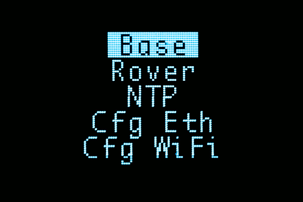
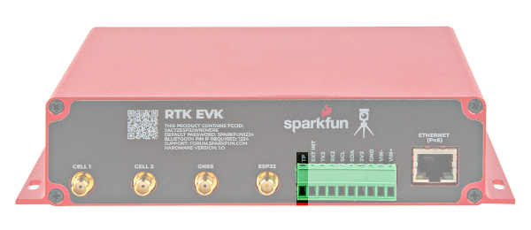

The electronics of the SparkFun RTK EVK is enclosed in a custom extruded aluminum case with machined end panels and slotted flanges.

  <table>
    <tr style="vertical-align:middle;">
     <td style="text-align: center; vertical-align: middle; border: solid 1px #cccccc;"></td>
     <td style="text-align: center; vertical-align: middle; border: solid 1px #cccccc;"></td>
    </tr>
    <tr style="vertical-align:middle;">
     <td style="text-align: center; vertical-align: middle; border: solid 1px #cccccc;"><i>Front View</i></td>
     <td style="text-align: center; vertical-align: middle; border: solid 1px #cccccc;"><i>Back View</i></td>
    </tr>
  </table>

The image below shows a top and bottom view of the populated PCB without the enclosure.

  <table>
    <tr style="vertical-align:middle;">
     <td style="text-align: center; vertical-align: middle; border: solid 1px #cccccc;"></td>
     <td style="text-align: center; vertical-align: middle; border: solid 1px #cccccc;"></td>
    </tr>
    <tr style="vertical-align:middle;">
     <td style="text-align: center; vertical-align: middle; border: solid 1px #cccccc;"><i>PCB Top View</i></td>
     <td style="text-align: center; vertical-align: middle; border: solid 1px #cccccc;"><i>PCB Bottom View</i></td>
    </tr>
  </table>

### Power

The SparkFun RTK EVK can be powered from the front or back of board. There is no internal battery. Schottky protection diodes and a resettable fuse are included to prevent conflicting voltages and overvoltage protection. Voltage is then regulated down to 3.3V through the three voltage regulators.

* **CONFIG ESP32** &mdash; The CONFIG ESP32 includes a USB C connector to power the RTK EVK. Users can also upload code or connect to the ESP32 to a serial terminal.
* **CONFIG UBLOX** &mdash; The CONFIG UBLOX includes a USB C connector to power the RTK EVK as well. A USB hub is connected to this port and connects to the ZED-F9P, NEO-D9S, and LARA-R6 for users that are interested in connecting them to u-center or updating the firmware.

  <table>
    <tr style="vertical-align:middle;">
     <td style="text-align: center; vertical-align: middle; border: solid 1px #cccccc;"></td>
    </tr>
    <tr style="vertical-align:middle;">
     <td style="text-align: center; vertical-align: middle; border: solid 1px #cccccc;"><i>USB Connectors Highlighted in Front</i></td>
    </tr>
  </table>

Power can also be provided from the I/O screw terminals or PoE.

* **V+** &mdash; The input voltage on this pin is between **+9V and +36V**. Voltage through this pin is brought down to 5V with the isolated DC-DC converter before regulated down to 3.3V. This is for users that want to pull power from a car battery or anything that is between the input voltage. This is connected to a fully-isolated DC-DC converter and regulates the voltage down to 5V.
* **V-** &mdash; For users connecting power through the V+, this is the essentially ground or 0V. Note that there is no direct connection between V- and GND.
* **GND** &mdash; The ground or 0V for the system.
* **Ethernet (PoE)** &mdash; The input voltage through the RJ45 connector is between **+36V and +57V**. Voltage is brought down to 5V with the isolated PoE module.

  <table>
    <tr style="vertical-align:middle;">
     <td style="text-align: center; vertical-align: middle; border: solid 1px #cccccc;"></td>
    </tr>
    <tr style="vertical-align:middle;">
     <td style="text-align: center; vertical-align: middle; border: solid 1px #cccccc;"><i>USB Connector, Ethernet POE, and Power Input on Screw Terminals Highlighted in Back</i></td>
    </tr>
  </table>

There is also an output power pin for 3.3V on the I/O screw terminal.

* **3V3** &mdash; This pin is the output of one of the 3.3V voltage regulators (specifically the AP7361C). Note that this is only connected to the secondary power. This net is connected to the microSD card socket, ZED-F9P, NEO-D9S, LARA-R6, USB Hub, MagJack RJ45 connector's LEDs, and WIZnet 5500.

  <table>
    <tr style="vertical-align:middle;">
     <td style="text-align: center; vertical-align: middle; border: solid 1px #cccccc;"></td>
    </tr>
    <tr style="vertical-align:middle;">
     <td style="text-align: center; vertical-align: middle; border: solid 1px #cccccc;"><i>3.3V Input on Screw Terminals Highlighted in Back</i></td>
    </tr>
  </table>

### CH340 USB-to-Serial Converter

A CH340 USB-to-Serial converter is included between the USB-C connector and the ESP32. The chip can be used to send serial data between the RTK EVK and computer. You can view the output or configure the device through a serial terminal. You can also manually upload new firmware as well.

  <table>
    <tr style="vertical-align:middle;">
     <td style="text-align: center; vertical-align: middle; border: solid 1px #cccccc;"></td>
    </tr>
    <tr style="vertical-align:middle;">
     <td style="text-align: center; vertical-align: middle; border: solid 1px #cccccc;"><i>CH340 USB-to-Serial Converter Highlighted</i></td>
    </tr>
  </table>

The driver should automatically install on most operating systems. However, there is a wide range of operating systems out there. You may need to install drivers the first time you connect the chip to your computer's USB port or when there are operating system updates. For more information, check out our [How to Install CH340 Drivers Tutorial](https://learn.sparkfun.com/tutorials/how-to-install-ch340-drivers).

  <table>
    <tr>
      <td style="text-align: center; vertical-align: middle; border: solid 1px #cccccc;">
        <a href="https://learn.sparkfun.com/tutorials/how-to-install-ch340-drivers">
          

          

          <h3 style="text-align: left">
            <b>How to Install CH340 Drivers</b>
          </h3>
        </a>
      </td>
    </tr>
  </table>

### ESP32-WROVER Module

The [RTK Everywhere firmware](https://github.com/sparkfun/SparkFun_RTK_Everywhere_Firmware/tree/main/Firmware) is pre-loaded with the RTK EVK and flashed to the ESPRESSIF ESP32-WROVER module (with 16MB flash and 8MB PSRAM). The ESP32 handles all the processes. You can configure the EVK as a RTK base and push corrections to an NTRIP Caster. You can also configure the EVK as a RTK Rover and use corrections delivered over WiFi or Bluetooth. You can even update firmware over-the-air. For more information, we recommend checking out the [RTK Everywhere Product Manual](https://docs.sparkfun.com/SparkFun_RTK_Everywhere_Firmware/).

  <table>
    <tr style="vertical-align:middle;">
     <td style="text-align: center; vertical-align: middle; border: solid 1px #cccccc;"></td>
    </tr>
    <tr style="vertical-align:middle;">
     <td style="text-align: center; vertical-align: middle; border: solid 1px #cccccc;"><i>ESP32 Highlighted</i></td>
    </tr>
  </table>

!!! note
    The ESP32-WROVER module can only connect to a 2.4GHz WiFi network. Unfortunately, 5GHz is not supported on the ESP32-WROVER module.

For users that want to configure the ESP32 using a serial terminal, you will simply need to connect the CONFIG ESP32 to your computer's USB port. Once connected, open a serial terminal set to **115200 baud** and press any key to open the [serial configuration menu](https://docs.sparkfun.com/SparkFun_RTK_Everywhere_Firmware/configure_with_serial/#rtk-torch). Of course, this is only one method of adjusting the settings. You can also change the settings through WiFi, Bluetooth, and a text file saved on a microSD card.

### ESP32 Primary I2C Port

The screw terminal on the back includes an I2C port. This is connected to the ESP32&apos;s primary I2C port.

* **SCL** &mdash; The ESP32 I2C bus clock on pin 22. The logic level is 3.3V. Currently, there are no pull-up resistors attached to this line. To configure, you will need to add a solder blob to the I2C jumper.
* **SDA** &mdash;ESP32 I2C bus data on pin 21. The logic level is 3.3V. Currently, there are no pull-up resistors attached to this line. To attach the 2.2k&ohm; pull-up resistors to the port, you will just need to add a solder blob to the I2C jumper.

!!! note
    3.3V and GND are also conveniently placed next to the SCL and SDA pins. These follow the same pinout as most of the SparkFun I2C breakout boards with PTHs.

  <table>
    <tr style="vertical-align:middle;">
     <td style="text-align: center; vertical-align: middle; border: solid 1px #cccccc;"></td>
    </tr>
    <tr style="vertical-align:middle;">
     <td style="text-align: center; vertical-align: middle; border: solid 1px #cccccc;"><i>I2C Port Highlighted</i></td>
    </tr>
  </table>

The I2C peripherals connected to the primary I2C port and their address are listed below:

* ZED-F9P &mdash; 0x42 (default)
* NEO-D9S &mdash; 0x43 (default)

Users can also connect to the USB hub over I2C by adding a solder blob to the jumper with two pads labeled as I2C. Once connected, the peripheral will be connected to the primary I2C port. The associated address is listed below.

* USB Hub &mdash; 0x2C

### ESP32 Secondary I2C Port

Inside of the enclosure, there is a Qwiic vertical port available. This is connected to the Qwiic OLED via a Qwiic cable. This port is connected to the ESP32's secondary I2C port with SCL connected to pin 15 and SDA1 connected to pin 12. The logic level is also 3.3V. Currently, there are no pull-up resistors attached to this line. To attach the 2.2k&ohm; pull-up resistors to the port, you will just need to add a solder blob to the I2C jumper.

  <table>
    <tr style="vertical-align:middle;">
     <td style="text-align: center; vertical-align: middle; border: solid 1px #cccccc;"></td>
    </tr>
    <tr style="vertical-align:middle;">
     <td style="text-align: center; vertical-align: middle; border: solid 1px #cccccc;"><i>I2C Port Highlighted</i></td>
    </tr>
  </table>

The I2C peripheral connected to the secondary I2C port and their address is listed below:

* Qwiic OLED - (1.3in., 128x64) &mdash; 0x3D (default)

### Qwiic OLED Display

The RTK EVK includes the SparkFun Qwiic OLED - (1.3in., 128x64). This is connected to the ESP32 via a Qwiic port contained within the enclosure. As stated earlier, the default address for the display is 0x3D. The display provides useful information about the RTK EVK without needing to connect to a serial terminal.

  <table>
    <tr style="vertical-align:middle;">
     <td style="text-align: center; vertical-align: middle; border: solid 1px #cccccc;"></td>
    </tr>
    <tr style="vertical-align:middle;">
     <td style="text-align: center; vertical-align: middle; border: solid 1px #cccccc;"><i>OLED Display Highlighted</i></td>
    </tr>
  </table>

Below are a few examples showing some of the possible outputs from the RTK EVK. The icons are explained further in the [RTK Everywhere Product Manual > Hardware > Displays](https://docs.sparkfun.com/SparkFun_RTK_Everywhere_Firmware/displays/).

  <table>
    <tr style="vertical-align:middle;">
     <td style="text-align: center; vertical-align: middle; border: solid 1px #cccccc;"></td>
     <td style="text-align: center; vertical-align: middle; border: solid 1px #cccccc;"></td>
     <td style="text-align: center; vertical-align: middle; border: solid 1px #cccccc;"></td>
    </tr>
    <tr style="vertical-align:middle;">
     <td style="text-align: center; vertical-align: middle; border: solid 1px #cccccc;"><i>OLED Display Output</i></td>
     <td style="text-align: center; vertical-align: middle; border: solid 1px #cccccc;"><i>OLED Display with RTK Fixed Solution</i></td>
     <td style="text-align: center; vertical-align: middle; border: solid 1px #cccccc;"><i>OLED Display Cycling Through Modes</i></td>
    </tr>
  </table>

### ZED-F9P Module

The RTK EVK wouldn't be a an RTK without well... a high precision RTK. The RTK EVK includes a built-in u-blox ZED-F9P module for high precision GNSS. You will need to connect an active multiband antenna that is capable of receiving L1 and L2 signals. The ZED-F9P can be set as a base station or rover. There are several options to send or receive correction data depending on the mode: Ethernet, WiFi network, LTE cellular network, or the NEO-D9S. As stated earlier, the ZED-F9P is connected to the primary I2C port and uses the default address of 0x42.

  <table>
    <tr style="vertical-align:middle;">
     <td style="text-align: center; vertical-align: middle; border: solid 1px #cccccc;"></td>
    </tr>
    <tr style="vertical-align:middle;">
     <td style="text-align: center; vertical-align: middle; border: solid 1px #cccccc;"><i>ZED-F9P Highlighted</i></td>
    </tr>
  </table>

Below are a few specifications taken from the ZED-F9P&apos;s datasheet:

* Concurrent reception of GPS, GLONASS, Galileo, and BeiDou
* Receives both L1C/A and L2C bands
* 184-channel u-blox F9 engine
* Time to First Fix: 25s (cold), 2s (hot)
* Max Navigation Rate: 20Hz / 25Hz depending on mode
* Horizontal Position Accuracy: 2.5m without RTK; 0.010m with RTK
* Max Altitude: 50km (31 miles)
* Max Velocity: 500m/s (1118mph)

### ZED-F9P Secondary UART Port

The screw terminal on the back includes a UART port. This is connected to the ZED-F9P's secondary UART port for users that want to connect to other high precision GNSS modules for correction data.

* **TX2** &mdash; The ZED-F9P's UART2 transmit pin. The logic level is 3.3V. Users can connect this pin to a radio module or directly to a high precision GNSS module's RX pin to provide correction data to other rovers.
* **RX1** &mdash; The ZED-F9P's UART2 receive pin. The logic level is 3.3V. Users can connect this pin to a radio module or directly to a high precision GNSS module's TX pin to receive correction data provided by another base station.

  <table>
    <tr style="vertical-align:middle;">
     <td style="text-align: center; vertical-align: middle; border: solid 1px #cccccc;"></td>
    </tr>
    <tr style="vertical-align:middle;">
     <td style="text-align: center; vertical-align: middle; border: solid 1px #cccccc;"><i>ZED-F9PUART Correction Port Highlighted</i></td>
    </tr>
  </table>

### ZED-F9P External Interrupt

The screw terminal on the back includes an external interrupt for the ZED-F9P. The interrupt can either be an input/output pin. This can be configured using u-center to bring the module out of deep sleep or to output an interrupt for various module states.

  <table>
    <tr style="vertical-align:middle;">
     <td style="text-align: center; vertical-align: middle; border: solid 1px #cccccc;"></td>
    </tr>
    <tr style="vertical-align:middle;">
     <td style="text-align: center; vertical-align: middle; border: solid 1px #cccccc;"><i>ZED-F9P External Interrupt Highlighted</i></td>
    </tr>
  </table>

### ZED-F9P Time Pulse

The screw terminal on the back labeled as **TP** includes ZED-F9Ps time pulse output (i.e. the pulse-per-second or PPS output). This pulses at 1Hz when the module gets basic GPS/GNSS position lock and can be configured using the u-center.

  <table>
    <tr style="vertical-align:middle;">
     <td style="text-align: center; vertical-align: middle; border: solid 1px #cccccc;"></td>
    </tr>
    <tr style="vertical-align:middle;">
     <td style="text-align: center; vertical-align: middle; border: solid 1px #cccccc;"><i>ZED-F9P Time Pulse Highlighted</i></td>
    </tr>
  </table>

### NEO-D9S

The RTK EVK includes the built-in u-blox NEO-D9S for correction data. You will need to connect an antenna that is capable of receiving signals from the L-band to access [u-blox PointPerfect correction service](https://www.u-blox.com/en/product/pointperfect). The NEO-D9S is connected to the primary I2C port and uses the default address of 0x43. You will need a service provider to access the correction data.

  <table>
    <tr style="vertical-align:middle;">
     <td style="text-align: center; vertical-align: middle; border: solid 1px #cccccc;"></td>
    </tr>
    <tr style="vertical-align:middle;">
     <td style="text-align: center; vertical-align: middle; border: solid 1px #cccccc;"><i>NEO-D9S Highlighted</i></td>
    </tr>
  </table>

Below are a few specifications taken from the NEO-D9S&apos;s datasheet:

* L-Band data receiver compliance: SESTB28A
* Frequency range: 1525 to 1559MHz
* Sensitivity: 133dBm
* Time to First Frame: <10s
* Receives PMP messages from Inmarsat Geosynchronous Satellites

### MicroSD Card Socket

The front of the RTK EVK includes a microSD card socket. Insert a microSD card into the socket until it clicks in place. Pushing the microSD card again will eject the memory card. This is connected to the ESP32&apos;s SPI port. Power is provided by the secondary power source. Users can manually flash the firmware binaries using the microSD card as opposed to over-the-air updates. Typically, the microSD card is for datalogging. The microSD card can also hold the user preferences for anyone that is interested in deploying multiple RTK EVKs with the same settings out in the field.

  <table>
    <tr style="vertical-align:middle;">
     <td style="text-align: center; vertical-align: middle; border: solid 1px #cccccc;"></td>
    </tr>
    <tr style="vertical-align:middle;">
     <td style="text-align: center; vertical-align: middle; border: solid 1px #cccccc;"><i>MicroSD Card Slot Highlighted</i></td>
    </tr>
  </table>

!!! note
    The RTK EVK only supports cards formatted as FAT32, which is why we recommend 32GB cards. It does not support exFAT - and most 64GB cards come pre-formatted with exFAT.

    If you need to re-format your card at any time, we recommend using the official [SD Association Formatter](https://www.sdcard.org/downloads/formatter/).

### LARA-R6 Cellular Module

The RTK EVK also includes the u-blox LARA-R6 cellular module for users that need to connect to a LTE cellular network. The module is connected to the ESP32 via UART.

  <table>
    <tr style="vertical-align:middle;">
     <td style="text-align: center; vertical-align: middle; border: solid 1px #cccccc;"></td>
    </tr>
    <tr style="vertical-align:middle;">
     <td style="text-align: center; vertical-align: middle; border: solid 1px #cccccc;"><i>LARA-R6 Highlighted</i></td>
    </tr>
  </table>

Below are a few specifications taken from the LARA-R6&apos;s datasheet:

  * Region: Global
  * LTE FDD Bands: 1, 2, 3, 4, 5, 7, 8, 12, 13, 18, 19, 20, 26, & 28
  * Certifications and approvals:
  * PTCRB, GCF, FCC, ISED, RED, UKCA, NCC, RCM, Giteki, Anatel, KC, AT&T,
  * Verizon, T-Mobile, Deutsche Telekom, Telefonica, NTT DoCoMo, SBM, KDDI, Telstra

!!! note
    Although the LARA supports GSM/GPRS, the RTK EVK does not due to the high current required.

!!! note
    Currently, the RTK Everywhere firmware does not support cellular with the LARA-R6. However, we have written and tested extra code examples which will allow you to stream MQTT correction data from a u-blox PointPerfect Localized Distribution topic via the LARA-R6 cellular chip. This example demonstrates how easy it is to subscribe to PointPerfect and only receive the IP correction data you need for your location, minimizing your cellular data costs.

### Nano SIM Card Socket

To connect to an cellular network with the built-in u-blox LARA-R6 (specifically the LARA-R6001D), you will need a nano SIM card. The cellular module works with most major North American carriers (Verizon, T-Mobile, AT&T, etc.). Make sure to check with your network service provider for compatibility. You also may need approval with the service carrier before the service is activated. We recommend using the [Hologram SIM Card](https://www.sparkfun.com/products/17117).

  <table>
    <tr style="vertical-align:middle;">
     <td style="text-align: center; vertical-align: middle; border: solid 1px #cccccc;"></td>
    </tr>
    <tr style="vertical-align:middle;">
     <td style="text-align: center; vertical-align: middle; border: solid 1px #cccccc;"><i>LED Highlighted</i></td>
    </tr>
  </table>

### WIZnet W5500 IC, Ethernet Jack, and PoE

The RTK EVK includes a built-in Ethernet circuitry. You can connect an Ethernet cable to the back of the RTK EVK's RJ45 MagJack port. This connector includes status LEDs for Link and Activity. These LEDs can be disabled by cutting the jumpers on the back of the PCB. The port connects to the Power-over-Ethernet (PoE) module and WIZnet W5500 Ethernet transceiver. 10/100Mbps is supported with auto-negotiation. As stated earlier, the PoE module can be powered using the standard PoE voltages between +36V to +57V. Make sure to choose a PoE Ethernet Switch that meeds your needs. We have had good experience with the [TP Link TL-SG1005P](https://www.tp-link.com/us/business-networking/poe-switch/tl-sg1005p/) - available from many retailers including [Amazon](https://www.amazon.com/TP-Link-Compliant-Shielded-Optimization-TL-SG1005P/dp/B076HZFY3F).

  <table>
    <tr style="vertical-align:middle;">
     <td style="text-align: center; vertical-align: middle; border: solid 1px #cccccc;"></td>
     <td style="text-align: center; vertical-align: middle; border: solid 1px #cccccc;"></td>
    </tr>
    <tr style="vertical-align:middle;">
     <td style="text-align: center; vertical-align: middle; border: solid 1px #cccccc;"><i>WIZnet W5500 IC, Ethernet Jack, and PoE Module Highlighted</i></td>
     <td style="text-align: center; vertical-align: middle; border: solid 1px #cccccc;"><i>Ethernet Jack Highlighted</i></td>
    </tr>
  </table>

### Antenna Connections

The back of the SparkFun RTK EVK includes a few connectors for cellular, GNSS, and WiFi antennas.

* **Cell 1** &mdash; The SMA Connector labeled as **Cell 1** is for the u-blox LARA-R6006. This connection represents the main RF input/output for LTE/3G/2G RF signals transmission and reception. This is intended to connect the LTE Hinged External Antenna - 698MHz-2.7GHz.
* **Cell 2** &mdash; The SMA Connector labled as **Cell 1** is for the u-blox LARA-R606. This connection represents the secondary RF input for LTE/3G Rx diversity and LTE MIMO 2x2 down-link RF signals reception. This is intended to connect the second LTE Hinged External Antenna - 698MHz-2.7GHz.
* **GNSS** &mdash; The SMA connector labeled as **GNSS** is for the u-blox ZED-F9P and NEO-D9S. This is connected to a GNSS splitter (Power Divider) and allows you to connect a single GNSS antenna for both modules. This is intended to connect an active multiband GNSS antenna using the SMA male to TNC male interface cable that is included in the kit. The RTK EVK provides 5V on this connector for an active multiband antenna instead of the usual 3.3V. Short-circuit and open-circuit detection is built into this connection as well. The following icons will flash whenever the RTK EVK does not detect an antenna (i.e. an open circuit) or if there is a short in the cable. Next to the icons will also indicate that there will be 0 satellites in view.

  <table>
    <tr style="vertical-align:middle;">
     <td style="text-align: center; vertical-align: middle; border: solid 1px #cccccc;"></td>
     <td style="text-align: center; vertical-align: middle; border: solid 1px #cccccc;"></td>
    </tr>
    <tr style="vertical-align:middle;">
     <td style="text-align: center; vertical-align: middle; border: solid 1px #cccccc;"><i>Antenna Open Circuit Highlighted</i></td>
     <td style="text-align: center; vertical-align: middle; border: solid 1px #cccccc;"><i>Antenna Short Circuit Highlighted</i></td>
    </tr>
  </table>

* **ESP32** &mdash; The RP-SMA connector labeled as **ESP32** is for the ESP32-WROVER. This is intended to connect the 2.4GHz WiFi/BT antenna.

  <table>
    <tr style="vertical-align:middle;">
     <td style="text-align: center; vertical-align: middle; border: solid 1px #cccccc;"></td>
    </tr>
    <tr style="vertical-align:middle;">
     <td style="text-align: center; vertical-align: middle; border: solid 1px #cccccc;"><i>Antenna Connectors Highlighted on Back</i></td>
    </tr>
  </table>

### Buttons

There are two buttons located on the front of the SparkFun RTK EVK.

* **RESET** &mdash; The reset button is available for users that need to manually reset the ESP32. The reset button sits flush against the front panel to prevent users from accidentally resetting the RTK EVK. You will need to press the button firmly or use a pen.
* **MODE** The mode button is available for users that want to change the mode. This button is connected to pin **0** on the ESP32 and can also be used as a boot button to set the ESP32 into bootloader mode when manually uploading code with the reset button.
    * **RTK Modes** &mdash; The available modes for the RTK EVK are listed below. A single press brings up the mode menu. Press the button twice to step through the available modes listed below. Pause on the highlighted mode to select it and change to that mode. For more information on the modes, make sure to check out the RTK Everywhere Manual.
        * **BASE**
        * **ROVER**
        * **NTP**
        * **Cfg Eth** Configure-Via-Ethernet
        * **CfgWiFi** Configure-Via-WiFi
        * **E-Pair** ESP NOW Pairing
    * **Bootloader Mode** &mdash; The boot button usually allows users to force the ESP32 into bootloader mode to manually upload new code to the ESP32.

  <table>
    <tr style="vertical-align:middle;">
     <td style="text-align: center; vertical-align: middle; border: solid 1px #cccccc;"></td>
    </tr>
    <tr style="vertical-align:middle;">
     <td style="text-align: center; vertical-align: middle; border: solid 1px #cccccc;"><i>Reset and Mode/Boot Buttons Highlighted</i></td>
    </tr>
  </table>

### LEDs

There are three LEDs available:

* **STATUS** &mdash; The built-in STATUS LED is used to indicate when the BASE mode has completed its survey-in.
* **LINK** &mdash; The built-in LINK LED on the RJ45 MagJack connector is connected to the WIZnet 5500&apos;s LINKLED pin and is used to indicate when there is a Ethernet Link.
* **ACT** &mdash; The built-in ACT LED on the RJ45 MagJack connector is connected to the WIZnet 5500&apos;s ACTLED pin and used to indicate when there is Ethernet activity.

  <table>
    <tr style="vertical-align:middle;">
     <td style="text-align: center; vertical-align: middle; border: solid 1px #cccccc;"></td>
     <td style="text-align: center; vertical-align: middle; border: solid 1px #cccccc;"></td>
    </tr>
    <tr style="vertical-align:middle;">
     <td style="text-align: center; vertical-align: middle; border: solid 1px #cccccc;"><i>LED Highlighted</i></td>
     <td style="text-align: center; vertical-align: middle; border: solid 1px #cccccc;"><i>LEDs on Ethernet Connector Highlighted</i></td>
    </tr>
  </table>

### Jumpers

!!!note
    If this is your first time working with jumpers, check out the [How to Work with Jumper Pads and PCB Traces](https://learn.sparkfun.com/tutorials/how-to-work-with-jumper-pads-and-pcb-traces/all) tutorial for more information.

The RTK EVK includes various jumpers on the back of the PCB.

* **SHLD** &mdash; There are two jumpers labeled as SHLD on the back of the PCB. These jumpers connect the USB Type C connector's shield pin to GND. By default, these are closed. Cut this to isolate the USB Type C connector's shield pin for the ESP32 and the ZED-F9P.
* **MEAS** &mdash; To enable measurements and determine how much power the RTK EVK uses, we've added a NC (normally closed) jumper between the two MEAS PTH pins. By cutting this jumper, the voltage connecting to the 3.3V voltage regulator input is interrupted. Soldering in a male jumper or wires into the accompanying holes will give you the ability to insert a current meter and precisely monitor how much current your application is consuming.
* **VIN+** &mdash; The VIN+ jumper connects the I/O Screw Terminal to the 5V DC-DC converter's VIN+ pin. This is closed by default. Cut this trace to disable the connection.
* **VIN-** &mdash; The VIN- jumper connects the I/O Screw Terminal to the 5V DC-DC converter's VIN- pin. This is closed by default. Cut this trace to disable the connection.
* **PW+** &mdash; The PW+ jumper connects the RJ45 MagJack's PW+ pin to the DP9905 PoE's VIN+ pin. This is closed by default. Cut this trace to disable the connection.
* **PW-** &mdash; The PW- jumper connects the RJ45 MagJack's PW- pin to the DP9905 PoE's VIN- pin. This is closed by default. Cut this trace to disable the connection.
* <b>GNSS Reset</b> &mdash; The GNSS reset jumper is open by default. Adding a solder blob will connect the reset button (which is currently only connected to the ESP32's reset pin) to the reset pins on both the ZED-F9P and NEO-D9S. Pulling the pin low by pressing the button will initiate a reset on the ZED-F9P and NEO-D9S. This will delete all information and trigger a cold start. As stated in the integration manual, this should only be used as a recovery option. Compared to the other jumpers, this jumper includes a 1x2 PTH. Users can also break off a [1x2 standard male header](https://www.sparkfun.com/products/116) and temporarily connect a [1x2 jumper](https://www.sparkfun.com/products/9044).
* **I2C** &mdash; This three way jumper labeled <code>I2C</code> will connect to two pull-up resistors to the I2C data and clock lines when closed. For advanced users that do not have pull-up resistors attached to the I2C lines on their microcontroller, make sure to close the jumpers with a little solder blob.
* **POE LOAD** &mdash; The POE LOAD creates a dummy load of 100mA on the DC/DC converter output. This is closed by default. Cut this trace to disable the dummy load.
* **WIZnet W5500 Mode Jumper** &mdash; For users that want to configure the WIZnet W5500 mode, there are three jumpers available to adjust the network mode. By default, the jumpers are set to 111 or "All capable, Auto-negotiation." For more information on the different modes, check out the WIZnet 5500 datasheet linked in the Resources.
    * **PMODE0** &mdash; Pulled high. Add as solder jumper to pull the pin low.
    * **PMODE1** &mdash; Pulled high. Add as solder jumper to pull the pin low.
    * **PMODE2** &mdash; Pulled high. Add as solder jumper to pull the pin low.
* **LED** &mdash; The LED jumper connects the status LED to the ESP32&apos;s pin 2. This is closed by default. Cut this trace to disable the status LED.
* **LINK** &mdash; The LINK jumper connects the RJ45 Link LED to the WIZnet 5500 LINKLED pin. This is closed by default. Cut this trace to disable the RJ45&apos;s Link LED.
* **ACT** &mdash;  The ACT jumper connects the RJ45 Activity LED to the WIZnet 5500 ACTLED pin. This is closed by default. Cut this trace to disable the RJ45&apos;s Link LED.
* **3V3 SW EN** &mdash; This three way jumper labeled **3V3 SW EN** enables the XC6222 3.3V/700mA voltage regulator for the RTK EVK's secondary power to provide power for the RJ45 MagJack LEDs, W5500, ZED-F9P, NEO-D9S, USB Hub, and Qwiic OLED.  By default, the trace is pulled high. Cut the trace and add a solder blob between the center pad and the other jumper to allow the ESP32 to toggle power using pin 32.
* **3V3 SW2 EN** &mdash; This three way jumper labeled **3V3 SW2 EN** enables the AP7361C 3.3V/1A voltage regulator for the RTK EVK's tertiary power to provide power for the LARA-R6. By default, the trace is pulled high. Cut the trace and add a solder blob between the center pad and the other jumper to allow the ESP32 to toggle power using pin 32.

  <table>
    <tr style="vertical-align:middle;">
     <td style="text-align: center; vertical-align: middle; border: solid 1px #cccccc;"></td>
    </tr>
    <tr style="vertical-align:middle;">
     <td style="text-align: center; vertical-align: middle; border: solid 1px #cccccc;"><i>Jumpers</i></td>
    </tr>
  </table>

### Dimensions

The SparkFun RTK EVK is designed around the [Metal Enclosure - Custom Aluminum Extrusion (6in. x 4in. PCB)](https://www.sparkfun.com/products/22640). You can find the dimensions of the enclosure below.

  <table>
    <tr style="vertical-align:middle;">
     <td style="text-align: center; vertical-align: middle; border: solid 1px #cccccc;"></td>
    </tr>
    <tr style="vertical-align:middle;">
     <td style="text-align: center; vertical-align: middle; border: solid 1px #cccccc;"><i>Enclosure and Panel Dimensions</i></td>
    </tr>
  </table>

Within the enclosure is the RTK EVK PCB. You can find the board dimensions below.

  <table>
    <tr style="vertical-align:middle;">
     <td style="text-align: center; vertical-align: middle; border: solid 1px #cccccc;"></td>
    </tr>
    <tr style="vertical-align:middle;">
     <td style="text-align: center; vertical-align: middle; border: solid 1px #cccccc;"><i>Board Dimensions</i></td>
    </tr>
  </table>

For users interested in the dimensions of the surveying antenna, it is also listed below from the [SPK6618H datasheet](https://cdn.sparkfun.com/assets/f/f/5/1/7/SparkFun_SPK6618H_Datasheet.pdf).

  <table>
    <tr style="vertical-align:middle;">
     <td style="text-align: center; vertical-align: middle; border: solid 1px #cccccc;"></td>
    </tr>
    <tr style="vertical-align:middle;">
     <td style="text-align: center; vertical-align: middle; border: solid 1px #cccccc;"><i>SPK6618H Surveying Antenna Dimensions</i></td>
    </tr>
  </table>

