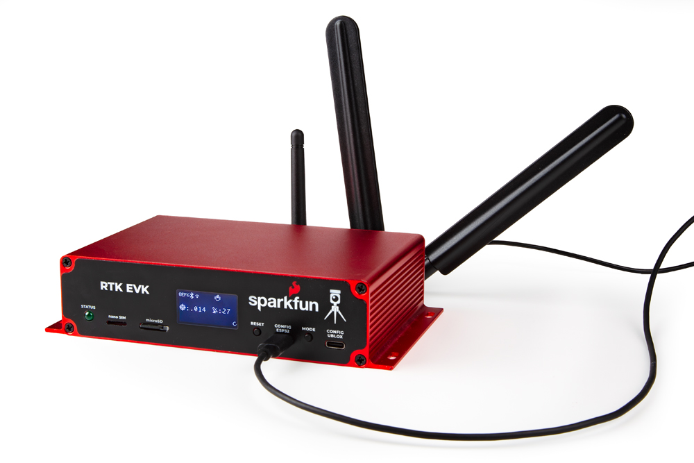
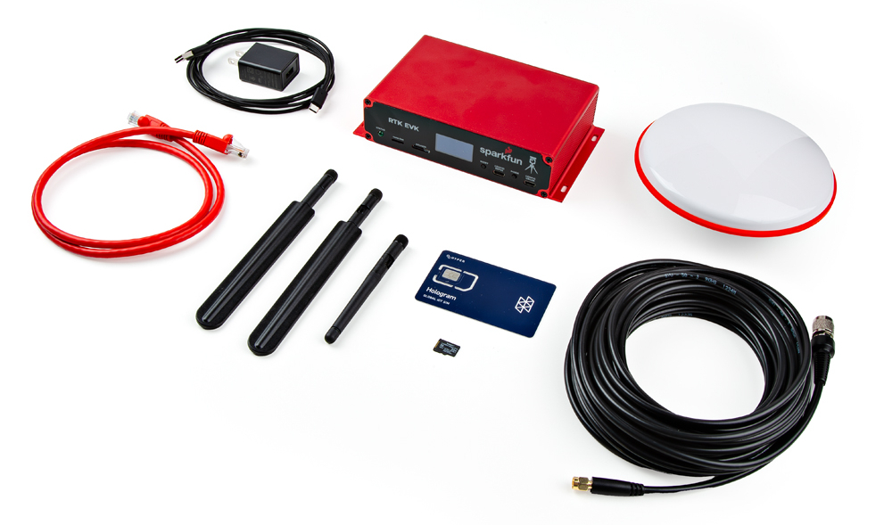

The SparkFun RTK EVK (Evaluation Kit) is the perfect development platform for your fixed or mobile high-precision positioning and navigation needs. In terms of connectivity, the SparkFun RTK EVK has the lot: WiFi / BT, Ethernet and LTE cellular! We called it the EVK (Evaluation Kit) as it truly covers all the options: L1 + L2 RTK GNSS, with L-Band correction built-in if needed, running on an agile processor with memory to spare!

-   <a href="https://www.sparkfun.com/products/24342">
      <figure markdown>
        
      </figure>
    </a>

    ---

    <a href="https://www.sparkfun.com/products/24342">
      <b>SparkFun RTK EVK</b>
       
      GPS-24342
       
      
[Purchase from SparkFun :fontawesome-solid-cart-plus:](https://www.sparkfun.com/products/24342){ .md-button .md-button--primary }

    </a>

!!! note
    Currently, the RTK Everywhere firmware does not support cellular with the LARA-R6. However, we have written and tested extra code examples which will allow you to stream MQTT correction data from a u-blox PointPerfect Localized Distribution topic via the LARA-R6 cellular chip. This example demonstrates how easy it is to subscribe to PointPerfect and only receive the IP correction data you need for your location, minimizing your cellular data costs.

In this tutorial we'll go over the hardware, assembly, and how get started with the SparkFun RTK.

### Kit Contents

The SparkFun RTK EVK comes with everything you need to get up and running. Our kit includes:

* 1x Cased GNSS Receiver
* 1x L1/L2/L5 GNSS Surveying Antenna
* 1x Reinforced RG58 TNC-SMA Cable (10m)
* 1x RPSMA WiFi / Bluetooth Antenna
* 2x SMA LTE Cellular Antennas
* 1x 32GB microSD Card (Class 10)
* 1x USB-C Power Supply (5V, 1A wall charger)
* 1x USB-C Cable (A to C, 2m)
* 1x Ethernet Cable (CAT-6, 1m)
* 1x Hologram eUICC nano-SIM card

  <table>
    <tr style="vertical-align:middle;">
     <td style="text-align: center; vertical-align: middle; border: solid 1px #cccccc;"></td>
    </tr>
    <tr>
      <td style="text-align: center; vertical-align: middle; border: solid 1px #cccccc;"><i>What's in the Box?</i>
      </td>
    </tr>
  </table>

#### GNSS Mounting Accessories

Depending on where you are installing the SparkFun RTK EVK, you also might need some mounting accessories to mount the GNSS antenna. You will want to mount the antenna in a location with the best view to of the sky (i.e. a roof).

<!-- ----------WHITE SPACE BETWEEN PRODUCTS---------- -->
-   <a href="https://www.sparkfun.com/products/21257">
      <figure markdown>
        
      </figure>
    </a>

    ---

    <a href="https://www.sparkfun.com/products/21257">
      <b>GNSS Magnetic Antenna Mount - 5/8" 11-TPI</b>
       
      GPS-21257
    </a>
<!-- ----------WHITE SPACE BETWEEN PRODUCTS---------- -->
-   <a href="https://www.sparkfun.com/products/22197">
      <figure markdown>
        
      </figure>
    </a>

    ---

    <a href="https://www.sparkfun.com/products/22197">
      <b>GNSS Antenna Mounting Hardware Kit</b>
       
      KIT-22197
    </a>
<!-- ----------WHITE SPACE BETWEEN PRODUCTS---------- -->

The RTK EVK comes with a custom extruded aluminum enclosure. The slotted flanges make it easy to install and secure the enclosure in many locations. If you are going to permanently install it up on a roof, you're going to need a suitable weatherproof box too. We found that the [Orbit 57095](https://www.orbitonline.com/products/gray-outdoor-timer-cabinet) - also [available from Amazon](https://www.amazon.com/Orbit-57095-Weather-Resistant-Outdoor-Mounted-Controller/dp/B000VYGMF2) - was a good one back when we put together our first [DIY GNSS Reference Station](https://learn.sparkfun.com/tutorials/how-to-build-a-diy-gnss-reference-station#mini-computer-setup-option-1).

<!-- ----------WHITE SPACE BETWEEN GRID CARDS---------- -->
-   <a href="https://learn.sparkfun.com/tutorials/how-to-build-a-diy-gnss-reference-station">
      <figure markdown>
        
      </figure>
    </a>

    ---

    <a href="https://learn.sparkfun.com/tutorials/how-to-build-a-diy-gnss-reference-station">
      <b>How to Build a DIY GNSS Reference Station</b>
    </a>
<!-- ----------WHITE SPACE BETWEEN GRID CARDS---------- -->

!!! note "AC Not Required!"
    The Orbit enclosure comes with a built-in power outlet, but you don't actually need it! The EVK can be powered by Power-over-Ethernet (PoE), meaning all you really need to run up to the roof is a standard 8-core CAT-6 Ethernet cable. Choose a PoE Ethernet Switch that meets your needs. We have had good experiences with the [TP-Link TL-SG1005P](https://www.tp-link.com/us/business-networking/poe-switch/tl-sg1005p/) - available from many retailers including [Amazon](https://www.amazon.com/TP-Link-Compliant-Shielded-Optimization-TL-SG1005P/dp/B076HZFY3F).

#### GNSS Interface Cable

The following interface cables are great if say you are mounting the SparkFun RTK EVK in your home on a desk or lab bench and installing the antenna outdoors.

<!-- ----------WHITE SPACE BETWEEN PRODUCTS---------- -->
-   <a href="https://www.sparkfun.com/products/21281">
      <figure markdown>
        
      </figure>
    </a>

    ---

    <a href="https://www.sparkfun.com/products/21281">
      <b>Interface Cable - SMA Female to SMA Male (10m, RG58)</b>
       
      CAB-21281
    </a>
<!-- ----------WHITE SPACE BETWEEN PRODUCTS---------- -->
-   <a href="https://www.sparkfun.com/products/22038">
      <figure markdown>
        
      </figure>
    </a>

    ---

    <a href="https://www.sparkfun.com/products/22038">
      <b>Interface Cable - RP-SMA Male to RP-SMA Female (10M, RG58)</b>
       
      CAB-22038
    </a>
<!-- ----------WHITE SPACE BETWEEN PRODUCTS---------- -->

#### Memory Cards

Finally, if you're going to be logging a lot of data, you might want to stock up on 32GB microSD cards too. The RTK EVK can log 'raw' GNSS data messages (RAWX and SFRBX) at 4Hz if desired. At that rate, you're logging about 10kB per second, close to 40MB per hour or 1GB per day!

<!-- ----------WHITE SPACE BETWEEN PRODUCTS---------- -->
-   <a href="https://www.sparkfun.com/products/19041">
      <figure markdown>
        
      </figure>
    </a>

    ---

    <a href="https://www.sparkfun.com/products/19041">
      <b>microSD Card - 32GB (Class 10)</b>
       
      COM-19041
    </a>
<!-- ----------WHITE SPACE BETWEEN PRODUCTS---------- -->

### Tools

Below are a few tools and accessories that you may need when connecting to the I/O terminal block on the back of the RTK EVK.

<!-- ----------WHITE SPACE BETWEEN PRODUCTS---------- -->
-   <a href="https://www.sparkfun.com/products/25568">
      <figure markdown>
        
      </figure>
    </a>

    ---

    <a href="https://www.sparkfun.com/products/25568">
      <b>iFixit Moray Driver Kit</b>
       
      TOL-25568
    </a>
<!-- ----------WHITE SPACE BETWEEN PRODUCTS---------- -->
-   <a href="https://www.sparkfun.com/products/12630">
      <figure markdown>
        
      </figure>
    </a>

    ---

    <a href="https://www.sparkfun.com/products/12630">
      <b>Wire Strippers - 30AWG (Hakko)</b>
       
      TOL-12630
    </a>
<!-- ----------WHITE SPACE BETWEEN PRODUCTS---------- -->
-   <a href="https://www.sparkfun.com/products/11367">
      <figure markdown>
        
      </figure>
    </a>

    ---

    <a href="https://www.sparkfun.com/products/11367">
      <b>Hook-Up Wire - Assortment (Solid Core, 22 AWG)</b>
       
      PRT-11367
    </a>
<!-- ----------WHITE SPACE BETWEEN PRODUCTS---------- -->

### Suggested Reading

If you aren’t familiar with the following concepts, we also recommend checking out a few of these tutorials before continuing.

<!-- ----------WHITE SPACE BETWEEN GRID CARDS---------- -->
-   <a href="https://learn.sparkfun.com/tutorials/what-is-gps-rtk">
      <figure markdown>
        
      </figure>
    </a>

    ---

    <a href="https://learn.sparkfun.com/tutorials/what-is-gps-rtk">
      <b>What is GPS RTK?</b>
    </a>
<!-- ----------WHITE SPACE BETWEEN GRID CARDS---------- -->
-   <a href="https://learn.sparkfun.com/tutorials/getting-started-with-u-center-for-u-blox">
      <figure markdown>
        
      </figure>
    </a>

    ---

    <a href="https://learn.sparkfun.com/tutorials/getting-started-with-u-center-for-u-blox">
      <b>Getting Started with U-Center for u-blox</b>
    </a>
<!-- ----------WHITE SPACE BETWEEN GRID CARDS---------- -->
-   <a href="https://learn.sparkfun.com/tutorials/gps-rtk2-hookup-guide">
      <figure markdown>
        
      </figure>
    </a>

    ---

    <a href="https://learn.sparkfun.com/tutorials/gps-rtk2-hookup-guide">
      <b>GPS-RTK2 Hookup Guide</b>
    </a>
<!-- ----------WHITE SPACE BETWEEN GRID CARDS---------- -->
-   <a href="https://learn.sparkfun.com/tutorials/setting-up-a-rover-base-rtk-system">
      <figure markdown>
        
      </figure>
    </a>

    ---

    <a href="https://learn.sparkfun.com/tutorials/setting-up-a-rover-base-rtk-system">
      <b>Setting up a Rover Base RTK System</b>
    </a>
<!-- ----------WHITE SPACE BETWEEN GRID CARDS---------- -->
-   <a href="https://learn.sparkfun.com/tutorials/how-to-build-a-diy-gnss-reference-station">
      <figure markdown>
        
      </figure>
    </a>

    ---

    <a href="https://learn.sparkfun.com/tutorials/how-to-build-a-diy-gnss-reference-station">
      <b>How to Build a DIY GNSS Reference Station</b>
    </a>
<!-- ----------WHITE SPACE BETWEEN GRID CARDS---------- -->

You may also be interested in the following blog posts on GNSS technologies.

-   <a href="https://www.sparkfun.com/news/4276">
	<figure markdown>
	
	</figure>

	---

	**GPS vs GNSS**</a>

-   <a href="https://www.sparkfun.com/news/7138">
	<figure markdown>
	
	</figure>

	---

	**What is Correction Data?**</a>

-   <a href="https://www.sparkfun.com/news/7533">
	<figure markdown>
	
	</figure>

	---

	**Real-Time Kinematics Explained**</a>

-   <a href="https://www.sparkfun.com/news/7401">
	<figure markdown>
	
	</figure>

	---

	**New Video: Unlocking High-Precision RTK Positioning**</a>

